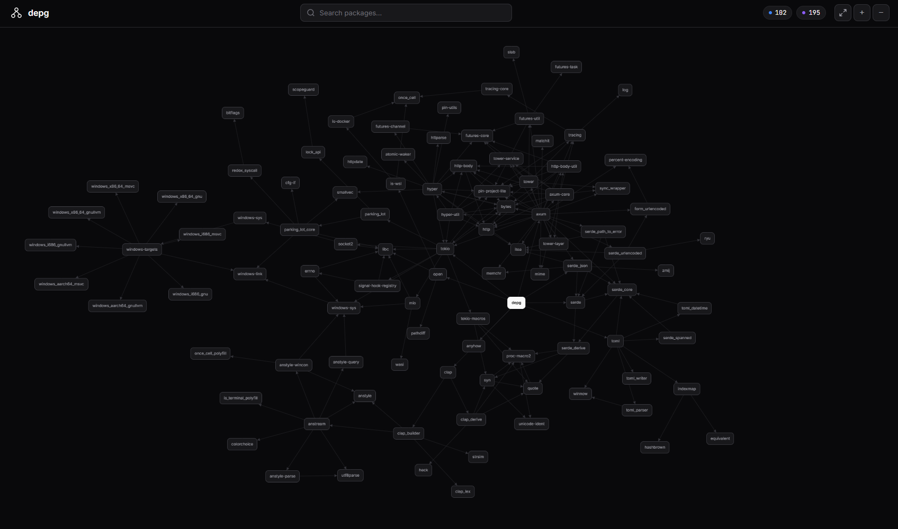
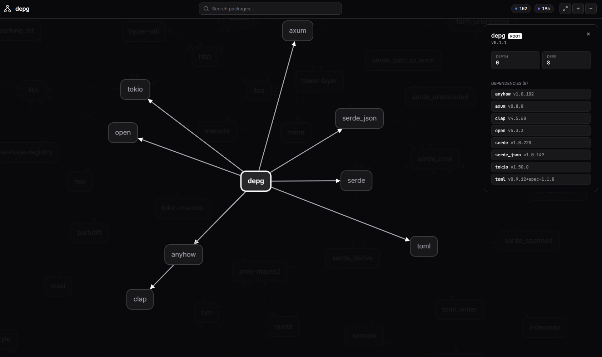

 

 

Recently, I watched a Veritasium video called "The Internet Was Weeks Away From Disaster and No One Knew." It dives deep into the history of the XZ Utils backdoor—a highly sophisticated, multi-year social engineering campaign that almost compromised OpenSSH and the entire open-source ecosystem. A malicious actor spent years gaining trust, slowly pushing malicious commits into a deeply buried compression library that everything else depends on. 

While I was watching that video, the idea for this project came to my mind. We were inches away from a global catastrophe, and it got me thinking.

How many of us actually know what we're running? We run `npm install`, `cargo build`, or `bun install`, and watch the terminal light up with hundreds of packages downloading. We treat the `node_modules` or target folders like a black box. It’s like plugging your brain directly into the Wired without checking if the connection is compromised. If a core dependency gets hijacked, we are all just sitting ducks. 

I hate flying blind. When I work on a project, I want to see the nervous system. I want to look at the graph of dependencies and see where the weak links are, where the bloat is coming from, and what exactly I’m inviting into my machine. 

So, I built something to fix that.

### Enter `depg` (Dependency Graph)

I wanted a localized, stupid-fast way to visualize exactly what my project relies on. No uploading my Cargo.lock to some sketchy third-party web service. Just a clean, instantaneous CLI tool that runs locally and maps out the entire dependency tree in an interactive graph.

I built it in Rust (Edition 2024), naturally, because if we're building CLI tools, we want them to be fast, memory-safe, and effortlessly concurrent. 

### Source Code & Installation

Source code is available at: [https://github.com/enrell/dependencies-graph](https://github.com/enrell/dependencies-graph)

**macOS / Linux:**
```sh
curl -fsSL https://raw.githubusercontent.com/enrell/dependencies-graph/main/install.sh | sh
```

**Windows (PowerShell):**
```powershell
irm https://raw.githubusercontent.com/enrell/dependencies-graph/main/install.ps1 | iex
```

**Cargo:**
```sh
cargo install --git https://github.com/enrell/dependencies-graph.git
```

### Usage

```sh
depg run
depg run --depth 2 --port 8080 --open
```

### How It Works

- `depg` searches your current directory for known lockfiles.
- It parses the complete dependency tree, handling ecosystem-specific resolution semantics.
- The graph data is serialized and served via an embedded, high-performance Axum web server.
- The client fetches the graph and renders it instantly onto a physics-driven, responsive canvas.

### Architecture

- **Backend Core**: Rust (Clap, Anyhow, Serde)
- **Extensible Parser Engine**: Built using a dynamic traits system making it easy to plug in support for new languages.
- **Web Server**: Axum + Tokio (static assets compiled directly into the binary).
- **Frontend Engine**: Vanilla JS + Cytoscape.js.

You run one command, and boom: your browser opens a fully interactive, physics-based constellation of your project's dependencies. You can zoom in, trace paths, and finally grasp the sheer scale of the shoulders your code is standing on. 

### Knowing is Half the Battle

Building `depg` wasn't just about making a cool visualizer; it was about reclaiming visibility. The XZ backdoor proved that open-source software relies heavily on trust, but trust shouldn't mean willful ignorance. 

If we have the tooling to easily visualize and audit the roots of our software, maybe we can spot the anomalies before they make it into production. 

You can check out the source code and try it yourself. Run it on your biggest project and tell me—does your dependency graph look like a well-architected city, or a chaotic, tangled mess?

See you in the The Wired.
