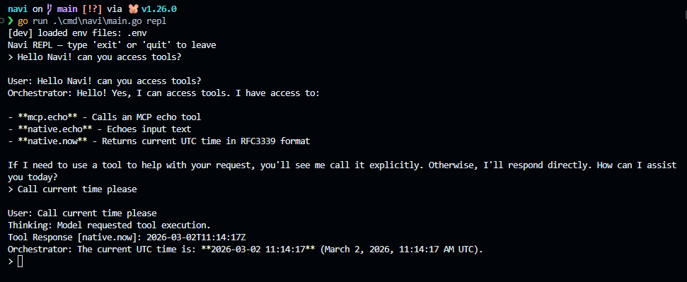

O último post foi sobre decisões de arquitetura.

Este aqui é sobre **execução**.

Passei esse ciclo transformando ideias em algo executável e testável. Não polido. Não "magia de IA". Apenas fundações reais.

## O que foi entregue desde o último post

### 1) Fatia vertical da API REST

Navi agora tem um backbone de API funcional com rotas de health, task e agent, incluindo fluxo síncrono.

Isso me deu um caminho completo de request → service → persistence → response, que é onde falhas reais de design começam a aparecer.

---

### 2) Persistência SQLite para tasks e agents

Movi o estado central da memória para o SQLite tanto para tasks quanto para metadados de agent.

Parece simples, mas muda tudo: comportamento ao reiniciar, debugging e confiança nos testes iterativos.

---

### 3) Sincronização real de agents + carregamento baseado em dados

A sincronização de agents não é mais falsa.  
Os agents são carregados a partir de definições no sistema de arquivos e sincronizados na persistência.

Isso se alinha ao princípio central do Navi: **agents são dados, não lógica hardcoded**.

---

### 4) Loop REPL/TUI para testes locais rápidos

Adicionei um REPL simples para exercitar comportamentos rapidamente sem precisar passar por HTTP o tempo todo.

O foco atual é tornar os outputs explícitos para que fique óbvio o que é:

- mensagem do usuário
- sinal de "pensamento" do modelo
- resposta de ferramenta
- resposta final do orquestrador

Essa visibilidade importa mais do que uma UI bonita agora.

---

### 5) Loop do orquestrador do Sprint 1 + chamada de ferramentas

Implementei um loop básico de orquestrador onde o modelo pode requisitar ferramentas através de um formato estruturado de tool-call, as ferramentas executam e os resultados alimentam o próximo turno.

Suporta padrões de chamada de ferramenta simples e múltiplos na mesma troca.

---

### 6) Caminho básico de integração MCP

Um caminho MCP mínimo está conectado para o fluxo de execução de ferramentas, suficiente para validar a direção da arquitetura sem construir demais cedo.

---

### 7) Onboarding de dev melhorado com .env

A experiência de clone limpo agora suporta configuração local baseada em .env para:

- Chave de API
- provider padrão
- modelo padrão
- modo de ambiente (`development`/`production`)

Na inicialização em modo desenvolvimento, Navi imprime quais arquivos .env foram carregados.  
Sem adivinhações, sem "por que essa configuração não está aplicando?" confusões.

---

### 8) Criação do diretório de configuração no primeiro uso é explícita

Navi agora cria seu diretório de configuração de usuário no primeiro uso antes da execução dos comandos.

Isso remove bastante atrito oculto para novos contribuidores.

---

## Teste de chamada de ferramentas

---

## Decisão de logging (importante)

Tive uma longa discussão de arquitetura sobre telemetria e estou escolhendo o caminho pragmático:

- Sem OpenTelemetry por enquanto
- Usar o `log/slog` nativo do Go
- Logs locais em JSON Lines (`.jsonl`) estruturados
- Rotação
- Tornar os logs fáceis para ferramentas MCP inspecionarem

Por quê: Navi é local-first agora. Quero observabilidade sem inchaço de dependências ou custo de complexidade.

Isso mantém as coisas minimais, testáveis e preparadas para o futuro.

---

## Nota de processo: arquiteto + execução em par com IA

Reescrevi esse projeto várias vezes. Protótipo → refatoração → erro → reescrever de novo.

Isso não é mais caos. É processo intencional.

Estou rodando um ciclo estilo XP com programação em par com IA:
- Eu cuido da arquitetura, fronteiras e trade-offs.
- A IA acelera a implementação, iteração de testes e refatorações mecânicas.

Então reescritas não são sinais de falha. São parte da convergência de design.

---

## Replanejamento do Sprint (atualizado)

### Sprint 1 — Estabilidade do runtime de agente único (atual)
- TUI simples do Navi ✅
- Agente orquestrador principal básico ✅
- Chamada de ferramentas básica ✅
- Integração MCP básica ✅
- Onboarding com .env ✅
- Revisão/replanejamento dos requisitos de pasta de configuração de agent ⏳
- Fundação de logging (`slog` + JSONL) ⏳

**Objetivo:** A TUI pede ao modelo para usar ferramentas e o fluxo de ferramentas é confiável/observável.

### Sprint 2 — Fatia vertical de agente especialista (sem agência completa ainda)
- Agentes especialistas básicos: planner, researcher, coder, tester (um ativo por vez)
- Expansão básica de ferramentas MCP nativas
- Mais comandos CLI
- Melhorias de UX da TUI (clareza, rastreabilidade, consistência)

**Objetivo:** A TUI pode chamar ferramentas MCP e rotear para um agente especialista por turno.

### Sprint 3 — Implantação de agência
- Delegação multi-agent controlada
- Guardrails (limites, política de falha, caminhos de recuperação)
- Melhor visão de timeline/debug de orquestração

**Objetivo:** coordenação multi-agent com comportamento previsível e traces debugáveis.

---

Infraestrutura sobrevive a ciclos de hype.  
Então estou construindo infraestrutura primeiro.

Se você também está construindo ferramentas de IA local-first, adoraria seu feedback sobre a direção de logging e a estrutura dos sprints.
