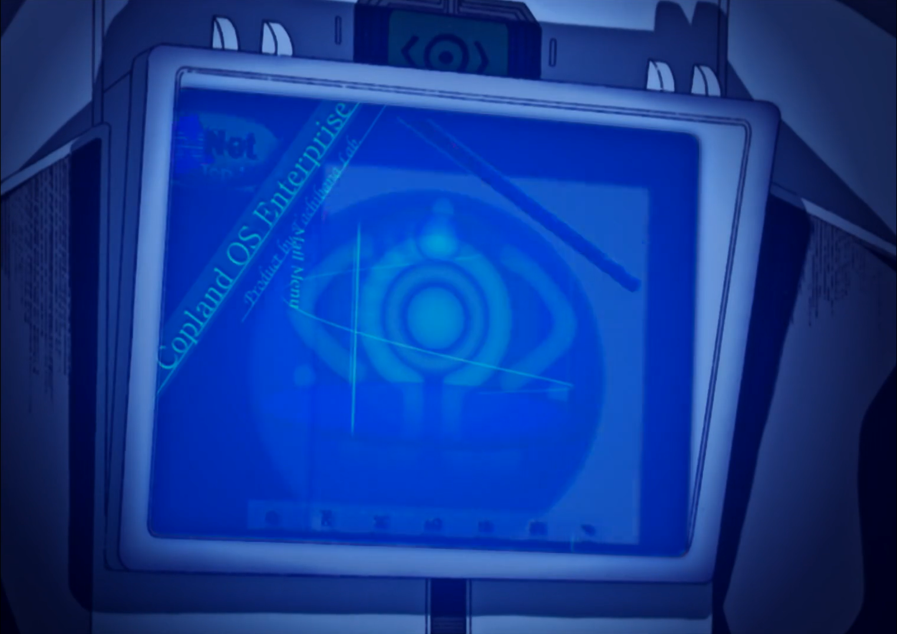

It was 2 AM. I was digging through my local anime folder trying to figure out why my media server hadn't picked up a new episode. I opened the SQLite database file out of curiosity — just to see what was in there.

I could read it. All of it. Every title. Every rating. Every entry in my watch history. Plain UTF-8 text, sitting unprotected on my disk.

I closed the terminal and stared at the ceiling for a while.

That's it. That's the whole story of why I'm building this.

## The State of Self-Hosted Media

You have Plex, which started as a community project and slowly turned into a product that asks you to log into *their* servers just to watch *your* files on *your* machine. You have Jellyfin — genuinely good, community-driven — but built in C#, with an architecture that makes some things harder than they need to be. You have Navidrome for music, Kavita for books, Komga for manga. Great tools, all of them. But every single one is a silo.

You watch anime on one app. Read manga on another. Listen to music on a third. Each one with its own database, its own auth system, its own idea of what your library looks like. And none of them take security seriously at the level I think it deserves.

None of them encrypt your metadata by default.

Think about that for a second. Your watch history. Your ratings. The titles of everything you've ever consumed. Sitting in a plaintext SQLite file on your disk. If someone steals your drive — or just has a few minutes unsupervised near your PC — they get a complete picture of your media consumption with zero effort.

That bothers me.

## What I'm Building

**Psyche** is a local-first, high-performance, high-security media server written in Rust.

Anime. Manga. TV shows. Books. Music. One server. One API. One frontend.

The name comes from Serial Experiments Lain (1998). In SEL, the Psyche is the self — private, local, encrypted. The boundary between what is yours and what belongs to the network. That's exactly what this server is. Your data. Your machine. Nobody else's business.

But more than that — it's built around the idea that your data is yours and nobody else's business. Your watch history is encrypted on disk. Your metadata is encrypted on disk. Your thumbnails are encrypted on disk. An attacker who gets filesystem access gets ciphertext. The server decrypts and re-encrypts in real time; plaintext never touches disk.

And when I say local-first, I mean it in the paranoid sense. Every remote feature — AniList sync, metadata APIs, LLM translation, lyrics lookups — has a local alternative. You can run Psyche with zero outbound connections and lose nothing but convenience. You can import the Kitsu database dump (the dev team shares it freely) and have full anime metadata offline forever.

## The Stack (and Why It Matters)

Rust. Axum. SQLite via sqlx. That's the core.

I chose Rust because I needed the compiler to be annoying. Seriously. When you're building something that handles encrypted user data, streams media, and walks a filesystem, you want a compiler that says "no" a lot. You want to know at compile time that you haven't introduced a buffer overflow, a data race, or a null dereference. The Rust compiler is extremely verbose and boring — and that's exactly what you want when security is the core value proposition.

The database is SQLite. Not Postgres. Not a document store. SQLite, because this is a *local-first* server and I refuse to make you run a database daemon just to watch your own anime. Async-native via sqlx, with compile-time query checking — the SQL is verified against the actual schema at compile time. No magic, no ORM hiding queries from you. Plain SQL migrations in numbered `.sql` files. Fully auditable.

The HTTP layer is Axum — Tower-native, composable, maintained by the Tokio team. No surprises.

## The First-Party Ecosystem

This isn't just a server. It's the beginning of an ecosystem. In SEL, Lain's NAVI is the hardware and software she uses to connect to the Wired. Each crate in this project is a layer — a piece of the stack that lets Psyche do what it does.

NAVI:

She does an insane upgrade to her NAVI — and that's the energy I'm bringing to this codebase:

You already know **zantetsu** — my anime filename parser that I wrote about a few months ago. It's Layer 00. The core of Psyche's scanner. It handles the chaos: `[SubsPlease] Jujutsu Kaisen - 24 (1080p) [A1B2C3D4].mkv`, `One Punch Man S02E03 1080p WEBRip x264.mkv`, all of it. 92%+ accuracy on the heuristic parser alone, with a DistilBERT + CRF neural fallback for the really weird ones.

But I'm building two more crates that don't exist yet:

**`psyche-translate`** (Layer 01) is a translation engine with a pluggable provider model. Remote LLM providers (OpenAI, Anthropic, Gemini), local providers via Ollama or llama.cpp, or nothing at all. The crate maintains episode context across segments so character names stay consistent. You can translate an entire subtitle track, a manga page, or a book chapter with one call — and the provider is just configuration.

**`fill-metadata`** (Layer 02) is the ambitious one. It's a machine learning pipeline that analyzes raw media files and *infers* metadata when none exists. Video scene analysis, audio fingerprinting, speech-to-text for title inference. If you have a folder full of unnamed video files from years ago, `fill-metadata` proposes what they are. You review, you approve, it commits to the database. No magic. No automatic commits. You're always in control.

## The OCR Pipeline

Here's where it gets interesting.

PGS subtitles — the bitmap-based subtitle format used on Blu-rays — are images. You can't search them, translate them, or copy text from them. Psyche will OCR them. Extract the text. Make it searchable.

But more than that: manga pages and book pages get the full treatment. OCR extracts text regions with bounding boxes. `psyche-translate` translates each region. A rendering pass reconstructs the image — translated text is typeset into the original bounding region, the original text is inpainted out, and you get a page that looks like the original but reads in your language.

Different OCR models for different domains. Manga panels and speech bubbles are not the same problem as a scanned book page. Treating them as the same problem is how you get bad results.

This is not a weekend hack. This is a pipeline I'm going to build correctly, one crate at a time.

## The Integrations

Sonarr. Radarr. Prowlarr. Lidarr. Readarr. Jackett. Discord rich presence. Discord bot. Webhooks. AniList sync. Spotify playlist import. Torrent streaming with sequential piece prioritization. All of it.

But — and this is important — all of it is opt-in. Every single integration is disabled by default. You enable what you want. And for every remote integration, there's a local alternative. The arr stack is already local. Jackett is already local. For everything else: Kitsu offline dump, local Ollama, local Jackett, NFO sidecar files.

The paranoid user path is fully supported. Not as an afterthought. As a design requirement.

## Plugins and the Wired

Here's where the SEL metaphor goes from aesthetic to structural.

The plugin system is sandboxed. Third parties can add metadata providers, scanner strategies, translation backends, export formats — without forking, without touching the core. The plugin boundary is explicit and enforced. What runs inside the plugin cannot reach outside it without going through a defined interface. That's not just good architecture. That's the only architecture I'll accept for a server that holds your encrypted data.

And further out — there's the Wired.

In SEL, the Wired is the network that connects all consciousness. The place where the boundary between self and other dissolves — but only if you choose to enter. That's the opt-in P2P community layer. Activity feeds. Ratings. Shared lists. Decentralised — no central server controls anything. You enable it by explicitly accepting the terms. Default state: fully off. No data leaves your machine unless you say so.

I genuinely don't know yet exactly how to build the Wired. Distributed systems at that level are outside my current expertise — which is part of why I'm writing this post. But I know what it needs to feel like: you are always Lain, connecting on your own terms. The network does not consume you. You reach into it and pull out what you want.

The monetization model is symbolic and optional. A store for cosmetic rewards — icons, badges, emoji packs, Discord roles. Discord-style: you pay for identity, never for features. Revenue goes to keeping me focused on building this instead of looking for other ways to pay rent.

Android app. Desktop app via Tauri. Web-first, native apps when the web experience is stable.

## Why GPL v3

I chose the GNU General Public License version 3 deliberately.

GPL v3 is the strongest copyleft license available. If someone forks Psyche and ships it — commercially or otherwise — they must release the full source under the same terms. You cannot take Psyche, close the source, and sell it. There is no enterprise exception path. There is no "dual licensing" trick. The community built it, the community keeps it.

I've watched too many self-hosted projects get acqui-hired or slowly enshittified. Jellyfin exists because Emby went closed-source. This won't happen to Psyche. The license makes it structurally impossible.

## The Current State

I'm at Phase 0. The Cargo workspace is bootstrapped. The React frontend template exists (it's beautiful, by the way). The docs are written: vision, architecture, security model, encryption contract.

Phase 1 is next: auth system, filesystem scanner, anime API, streaming, serving the frontend as a single binary. Each slice is tested before the next begins. TDD, no exceptions. One ridge at a time.

This is going to take years to reach the full vision. I know that. I'm not going to pretend otherwise.

But the foundation is being built correctly. The architecture decisions are documented. The security model is written before the first line of production code. The encryption contract specifies exactly what is encrypted, what is not, and why.

That's how you build something that lasts.

## You Read This Far. That Means Something.

Seriously. Most people bounced at the first paragraph. You didn't.

That tells me you're the kind of person who actually thinks about this stuff. Who notices when something is wrong and wonders if it could be better. Who got a little bothered by the idea of a plaintext file on disk cataloguing everything you've ever watched. Who looked at the fragmentation of self-hosted media and thought "someone should fix this."

That person is exactly who I'm looking for. And I mean that in the broadest possible sense.

I'm a technical guy. I can write Rust, design a database schema, wire up an API. I have experience with machine learning, mobile development, and P2P systems. But I have genuine blind spots — and this project needs more than just people who can code.

I have **no experience building communities**. None. I don't know how to grow a Discord server, how to write announcements that make people feel included, how to create a culture around a project. If you've done that — for any project, any community, anything — that knowledge is worth more to Psyche right now than another Rust PR.

I have experience with UI/UX enough to be functional. The frontend template I built looks clean, but I’m not a full time designer. I don’t know how a reader should feel flipping through manga pages. I don’t know what the perfect music player experience feels like. If you care about that — if you’ve ever redesigned something and made it feel right — there is a blank canvas here with your name on it.

I have **no deep expertise in advanced cryptography**. I know enough to design the AES-256-GCM pipeline, choose Argon2id, and write a threat model. But the people who can look at my key derivation scheme and find the subtle flaw I missed — those people don't exist in my network yet.

I have **no experience with advanced pentesting**. I can write secure code and think about threat models. But the people who attack systems for a living, who find the edge cases I didn't even know existed, who can tell me exactly where my security assumptions break — I need those people.

I have **no languages beyond English and Portuguese**. This thing is going to need to speak every language eventually — not just in the frontend, but in documentation, community, and support. If you speak another language and care about this project, there is space for you here.

I don't have a team. I don't have funding. I don't have a company behind this. I have a vision, a compiler, and a GPL v3 license that guarantees it stays free forever.

What I'm asking for is simple: **if something in this post made you think "I could help with that" — reach out.**

Not just developers. Designers, writers, community builders, ML researchers, mobile devs, security researchers, people who are just really opinionated about what a good media library experience should feel like. Translators — this thing is going to need to speak every language eventually. People who just want to report bugs with good screenshots and logs. People who want to write documentation because they know what it feels like to be lost in a project with none.

The contribution guide is strict about code quality because security is the core. But there is no strict bar for *caring*. If you care, there is space for you here.

The codebase has an `AGENTS.md` file that explains how we work — it was written to be read by humans and AI agents alike, because I use AI tools and I expect contributors will too. The rule isn't "no AI." The rule is "you own every line." Read it, understand it, and bring your whole self — tools included.

Write to **enrell@proton.me**. Tell me what you do, what you'd want to work on, or just that you read this and it resonated. That's enough to start a conversation.

Or open an issue. Or star the repository and show up when something moves you. There's no commitment required to care about something.

---

The dream is ambitious. The mountain is tall. But I've been staring at the dirty anime filenames in my local folder for years, waiting for the right tool to exist.

I got tired of waiting.

See you in the Wired.
